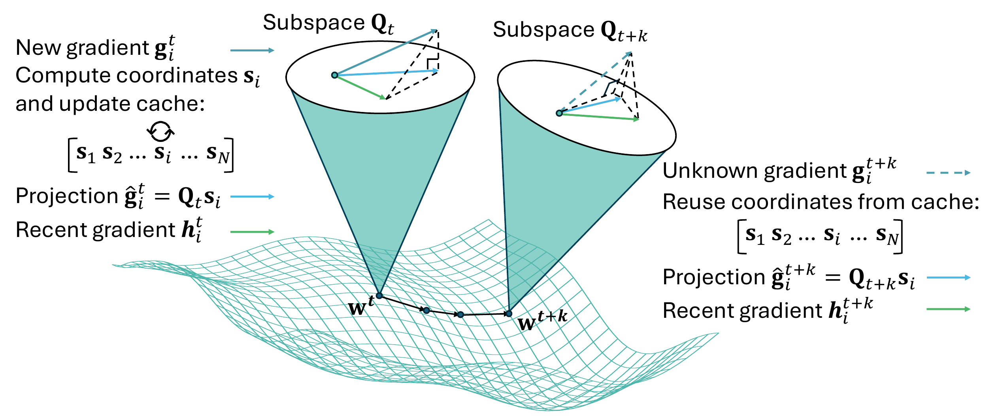

# FedSteer: Taming Extreme Gradient Staleness in Federated Learning

This repository provides the implementation of **FedSteer**, accepted to **UAI 2026**.

FedSteer addresses a key failure mode in federated learning with partial client participation: stale updates from rarely active clients can become so misaligned with the current model that directly reusing them destabilizes training. FedSteer corrects stale updates by projecting client gradients into a dynamic low-dimensional gradient subspace, caching stable projection coordinates, and reusing those coordinates with the latest subspace to steer inactive clients' historical information toward the current global objective.

Paper: [arXiv 2606.10124](https://arxiv.org/abs/2606.10124v1)

## Overview

<p align="center">
  
</p>

<p align="center">
  <em>FedSteer projects an active client's gradient onto a dynamic subspace, caches the low-dimensional coordinates, and later reuses those coordinates with the evolved subspace to estimate a corrected update for inactive clients.</em>
</p>

## Highlights

- **Problem:** Partial participation and skewed client availability make stale gradients increasingly misaligned with the current global model.
- **Key idea:** Projection coordinates can be more stable than raw stale gradients. FedSteer caches coordinates instead of relying on stale vectors directly.
- **Method:** A small core set of clients forms a dynamic gradient subspace. Active clients update their projection coordinates; inactive clients reuse cached coordinates with the latest subspace.
- **Memory efficiency:** FedSteer stores full gradients only for the core set and low-dimensional coordinates for all clients, reducing server cache cost from `O(Nd)` to `O(kd + Nk)` for core set size `k`.
- **Results:** The paper reports consistent gains over stale-update baselines, including preventing collapse under extreme heterogeneity and achieving at least 7.9% accuracy improvement over the next-best method in evaluated settings.

## Implementation

The code uses a script-based research workflow. The main entrypoint is:

- `main2.py`: parses experiment arguments, prepares datasets and clients, runs federated training, applies aggregation, and saves results.

Important modules:

- `utility/parser.py`: command-line arguments.
- `utility/preprocessing.py`: dataset loading for CIFAR-10, MNIST, Fashion-MNIST, EMNIST, and Shakespeare.
- `utility/model_list.py` and `utility/load_model.py`: model definitions and task-to-model selection.
- `utility/training.py`: local training routines.
- `utility/aggregation.py`: federated aggregation, stale update handling, and FedSteer-related aggregation utilities.
- `utility/optimal_sampling.py`: optimal sampling, projection, core-set, and distribution routines.
- `utility/matching.py`: OMP-style matching and projection helpers.

Additional notes are available in `docs/repository_structure.md` and `docs/experiments.md`.

## Installation

Create an environment and install dependencies:

```bash
conda create -n fedsteer python=3.10
conda activate fedsteer
pip install -r requirements.txt
```

The core dependencies are PyTorch, TorchVision, NumPy, tqdm, and CVXPY. If your machine needs a specific CUDA build, install the matching PyTorch and TorchVision wheels first, then install the remaining packages from `requirements.txt`.

## Quick Start

Run commands from the repository root.

Example Fashion-MNIST run:

```bash
python main2.py \
  --task_type fashion_mnist \
  --iid_type noniid \
  --algo_type proposed \
  --data_ratio 0.2 \
  --class_ratio 0.5 \
  --C 0.2 \
  --num_clients 30 \
  --local_epochs 1 \
  --round_num 20 \
  --notes quickstart_fashion_mnist \
  --insist
```

Representative experiment commands are collected in:

```bash
bash scripts/run_experiments.sh
```

The script preserves the original experiment settings and commented alternatives. Edit the sweep variables near the top of the script, then uncomment the command variant you want to run.

## Experiment Notes

Common options:

- `--task_type`: task list, such as `cifar10`, `mnist`, `fashion_mnist`, `emnist`, or `shakespeare`.
- `--iid_type`: one IID setting per task, typically `iid` or `noniid`.
- `--algo_type`: algorithm list, such as `proposed`, `random`, `bayesian`, or `round_robin`.
- `--C`: active client communication rate.
- `--num_clients`: number of simulated clients.
- `--local_epochs`: local training epochs per task.
- `--round_num`: number of global rounds.
- `--notes`: suffix added to the result directory name.
- `--insist`: overwrite an existing result directory for the same run name.

Outputs are written to `result/<experiment-name>/`. TorchVision datasets download under `utility/dataset/`; generated result files and downloaded datasets are ignored by git.

## Repository Layout

```text
main2.py                 # experiment entrypoint
utility/                 # datasets, models, training, aggregation, sampling
scripts/run_experiments.sh
docs/                    # experiment and structure notes
figures/                 # paper and result figures
result/                  # generated experiment outputs, ignored by git
```

## Citation

If you find this repository useful, please cite:

```bibtex
@inproceedings{zhang2026fedsteer,
  title = {FedSteer: Taming Extreme Gradient Staleness in Federated Learning with Corrective Projections and Caching},
  author = {Zhang, Haoran and Pereira, Caina Figueiredo and Siew, Marie and Liu, Xutong and Joe-Wong, Carlee and El-Azouzi, Rachid},
  booktitle = {Proceedings of the 42nd Conference on Uncertainty in Artificial Intelligence},
  year = {2026}
}
```
